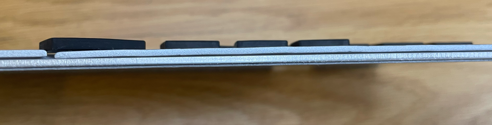

# escd-monolith keyboard

The "escd-monolith" keyboard is a single layer aluminum PCB keyboard with 3x12 column staggered keys, 8 thumb keys, and big delete and escape keys (46 keys total).
There are no LEDs, only for CHERRY MX Ultra Low Profile switches and Elite-Pi controller.

It's thin and rigid, but the keys are noisy and it's difficult to print keycaps.
I hope this is helpful in some way, but I don't recommend doing it exactly as is.

"escd" is pronounced as "escaped.”

## Design

